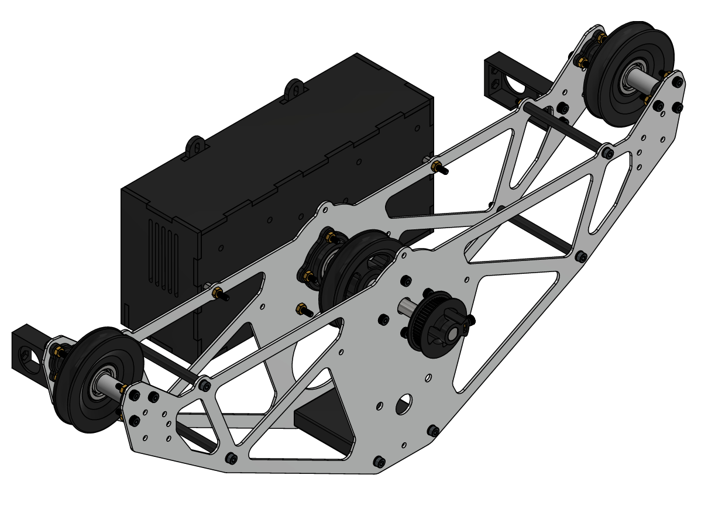
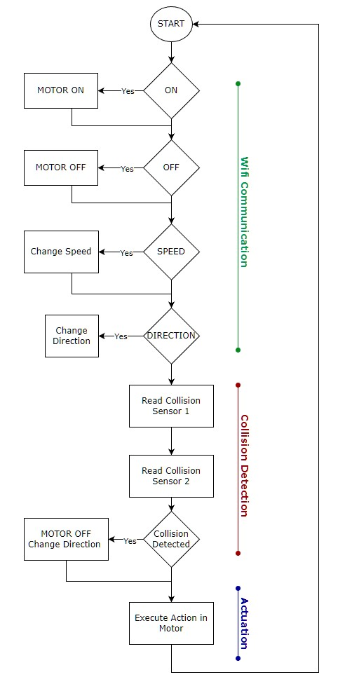
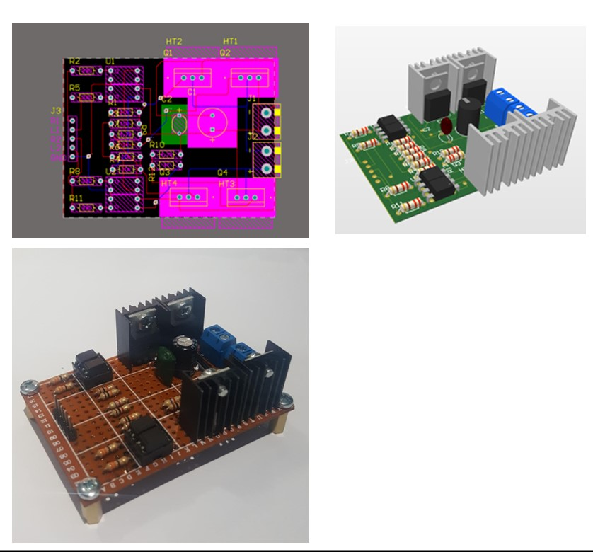

# Cable Cam Project

Welcome to the Cable Cam Project! This project was born out of a need for a simple, efficient, and safe cable cam that can carry small cameras, perfect for capturing smooth shots. Dive in to learn how we made it from scratch!

---

## Software

We developed an Android interface to control the cable cam over WiFi—keeping it simple with an "ON" push button and a velocity slider for easy operation.

**Safety First:** Dual ultrasonic sensors on both sides of the cable cam detect obstacles like poles to protect the system and your valuable camera equipment.

The Arduino handles:
- **Serial Communication** with the WiFi module.
- **Sensor Interruptions** for collision detection.
- **H-Bridge Control** for motor operations.

Given the high loads on the motors during acceleration and deceleration, speed control is gradual to protect our 3D-printed parts. The code is optimized to avoid any blocking functions, making everything time-efficient and safe.

Check out the softare diagram:

## Electrical Design

The cable cam runs on an Arduino UNO with an ESP8266 WiFi module (since we didn't have access to built-in WiFi solutions at the time). 

**High Power Motors:** With motors drawing more than 6A, we needed a robust motor driver to handle the load. So, we designed our own H-Bridge to keep costs low and overcome shop limitations during the pandemic. 

Check out our custom PCB design:

Take a look at the wiring diagram of the whole system:
[Wiring Diagram](docs/wiring_diagram.pdf)

---

## Want to build your own?

Our prototype is built with MDF and 3D-printed parts but is designed for aluminum sheet construction for greater durability. 

Grab the blueprints and assemeble it:

[Blueprints](docs/blueprints.pdf)

[Instructions](docs/Assembly_Instructions.pdf)

---

## Final Demo

Now, see the cable cam in full motion!

https://github.com/user-attachments/assets/bbfa1e48-467a-44d3-9430-5e7186b1f9d9

---

Credits:

- José Vásquez: Software and Electrical System Development
- Gabriel Fuentes: Frame Design
- Juan Jiménez: Power Transmission design
- Adrián Orozco: Power Transmission design
- Victor Vargas: Mechanical simulations
- 

Course: Manufacturing Systems | Mechatronics Engineering | Costa Rica Institute of Technology  | 2022
